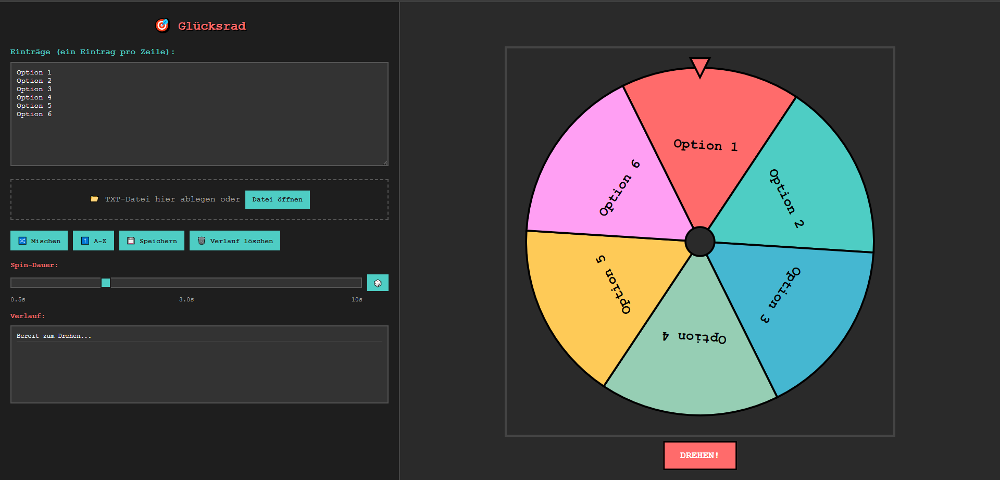
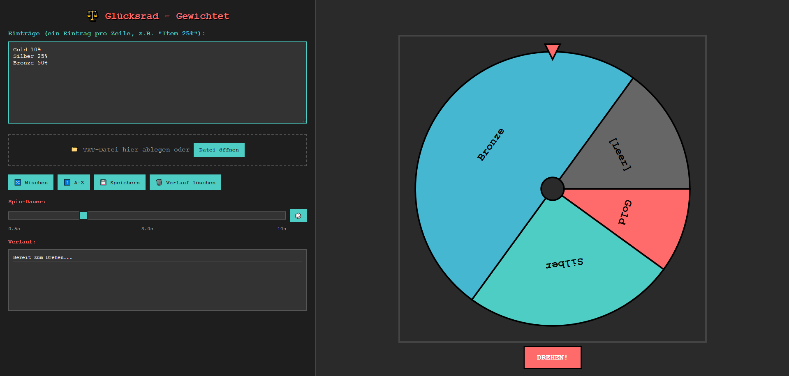
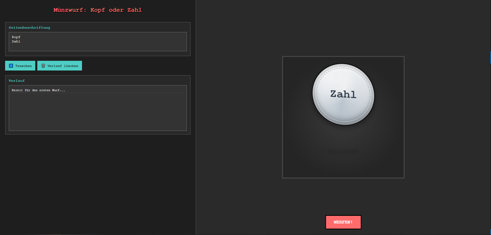
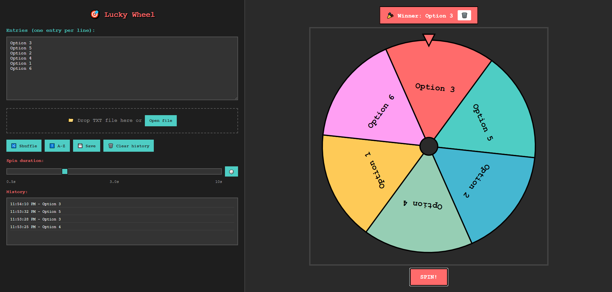
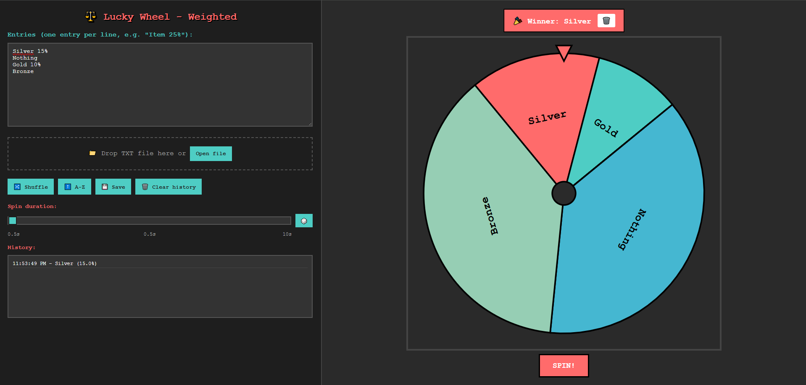
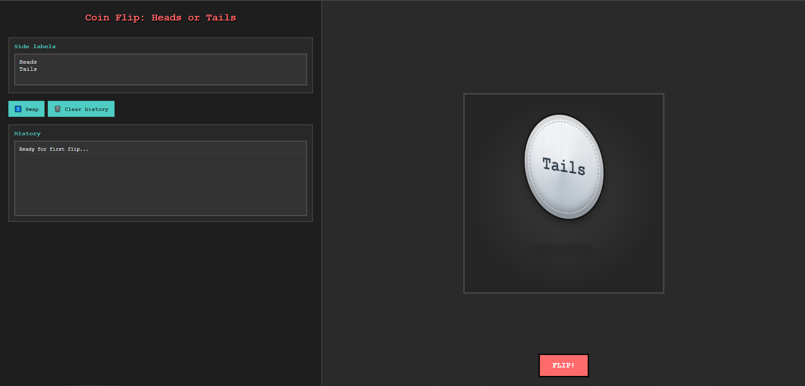

# BrowserLuck

BrowserLuck is a small collection of standalone luck-based browser games.
Every mode is a single HTML file that runs instantly in any modern browser.

## Quick Start

1. Download any `.html` file from this repo.
2. Open it directly in your browser.
3. Start using it immediately.

## Available Modes

### German files

- `gluecksrad.html` - Lucky wheel
- `gluecksrad-weighted.html` - Weighted lucky wheel
- `kopf-oder-zahl.html` - Coin flip

### English files

- `lucky-wheel.html` - Lucky wheel
- `lucky-wheel-weighted.html` - Weighted lucky wheel
- `coin-flip.html` - Coin flip

## Screenshots

### German files

`gluecksrad.html`

`gluecksrad-weighted.html`

`kopf-oder-zahl.html`

### English files

`lucky-wheel.html`

`lucky-wheel-weighted.html`

`coin-flip.html`

## Features

- Fully offline
- No install, no dependencies
- Keyboard shortcuts
- History tracking
- Save/load text input on wheel modes

## Keyboard Shortcuts

- `Space` - Spin / flip
- `Ctrl+S` - Save entries (wheel modes)
- `Ctrl+O` - Open entries file (wheel modes)
